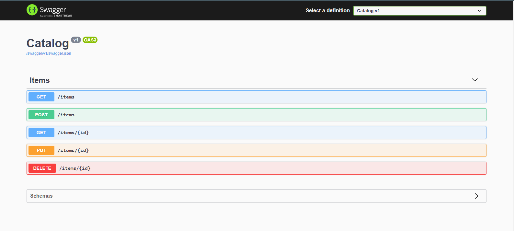

# Projeto: Catalog ✏️
 
 

    <a href="#sobre" align=center>Sobre</a>&nbsp;&nbsp;&nbsp;
    <a href="#linguagens" align=center>Linguagens & Frameworks</a>&nbsp;&nbsp;&nbsp;
    <a href="#referencias" align=center>Referências & Links</a>&nbsp;&nbsp;&nbsp;

 

### Sobre

Como criar uma API REST com .NET 5 e linguagem C#.

 

### Percurso 🧑‍🎓

 

- Getting Started
    - Introduction
    - Creating the project
    - Exploring the generated project files
    - Trusting the self-signed certificate
    - Exploring the default Swagger UI page
    - Configuring Visual Studio Code settings

- Entity, Repository, Controller GET
    - Introduction
    - Adding an entity
    - Ading an in-memory repository
    - Creating the controller
    - Implemeting GET all items
    - Implemeting GET single item
    - Returning a 404 NotFound status code

-   Dependency Injection, DTOSs
    - Introduction
    - What is dependency injection?
    - Extracting the repository interface
    - Injecting the repository into the controller
    - Registering the repository as a singleton
    - Adding a Data Transfer Object DTO
    - Creating the AsDto extension method

- POST, PUT, DELETE
    - Introduction
    - Implementing POST
    - Adding validations via data annotations
    - Implemeting PUT
    - Implementing DELETE

- Persisting Entities with MongoDB
    - Introduction
    - Using Postman
    - Creating a MongoDB repository
    - Using the MongoDB.Driver NuGet package
    - Implementing MongoDB Create
    - Running the MongoDB Docker container
    - Configuring MongoDB connection settings
    - Registering the MongoClient singleton
    - Testing the MongoDB integration
    - Exploring the created database in VS Code
    - Implemeting MongoDB Get, Update and Delete

- Tasks, Async and Await
    - Introduction
    - Using the Async suffix
    - Using tasks in the repository
    - Using async and await
    - Returning completed tasks
    - Using tasks in the controller
    - Testing async methods in Postman

- Secrets and Health Checks
    - Introduction
    - Enabling authentication in MongoDB
    - Using the .NET Secret Manager
    - Using the MongoDB credentials in the service
    - Introduction to Health Checks
    - Adding an endpoint for health checks
    - Adding a MongoDB health check
    - Adding checks for readiness and liveness
    - Customizing the health check response
    - Exploring other health check NuGet packages

- Docker
    - Introduction
    - What is Docker?
    - Removing https redirection
    - Generating a Dockerfile in VS Code
    - Building the Docker image
    - Adding a Docker network
    - Running the containers in the Docker network
    - Running the REST API in Docker
    - Pushing the container image to Docker Hub
    - Exploring the image in Docker Hub
    - Pulling the image back to the local box

- Kubernetes
    - Introduction
    - What is Kubernetes?
    - Enabling a Kubernetes cluster in Docker Desktop
    - Installing the Kubernetes extension for VS Code
    - Declaring the REST API Kuberentes deployment
    - Creating a secret in Kubernetes
    - Declaring health probes
    - Declaring the REST API Kubernetes service
    - Creating the REST API resources in Kubernetes
    - Declaring the MongoDB Kubernetes StatefulSet
    - Declaring the MongoDB Kubernetes service
    - Creating the MongoDB resources in Kubernetes
    - Testing the REST API hosted in Kubernetes
    - Exploring the Kubernetes self-healing capability
    - Scaling Kubernetes pods
    - Adding logs via ILogger
    - Getting a new image version into Kubernetes
    - Load balancing requests across pods

- Unit Testing and TDD
    - Introduction
    - What is unit testing?
    - What is test driven development?
    - Restructuring files and directories
    - Creating the xUnit test project
    - Building multiple projects in VS Code
    - Adding NuGet packages for unit testing
    - Testing GetItemAsync unexisting item
    - Using the AAA pattern
    - Stubbing dependencies via Moq
    - Running tests in VS Code
    - Using the .NET Core Test Explorer extension
    - Testing GetItemAsync existing item
    - Using FluentAssertions
    - Testing GetItemsAsync
    - Testing CreateItemAsync
    - Testing UpdateItemAsync
    - Testing DeleteItemAsync
    - Refactoring and catching regressions
    - Using TDD to test a yet to be created method
    - Going back to green by fixing the failing test
    - Testing the new controller method in Postman

 

### Status 

**_Em desenvolvimento 🚧ℹ️_**

 

### Linguagens & Frameworks

* C# 
* .NET 5

 

<h3 align=center id="referencias"><i>Referências & Links </i>📖🙋‍♂️</h3> 

.NET 5 REST API Tutorial - Build From Scratch With C# - [FreeCodeCamp.org](https://youtu.be/ZXdFisA_hOY)

 

